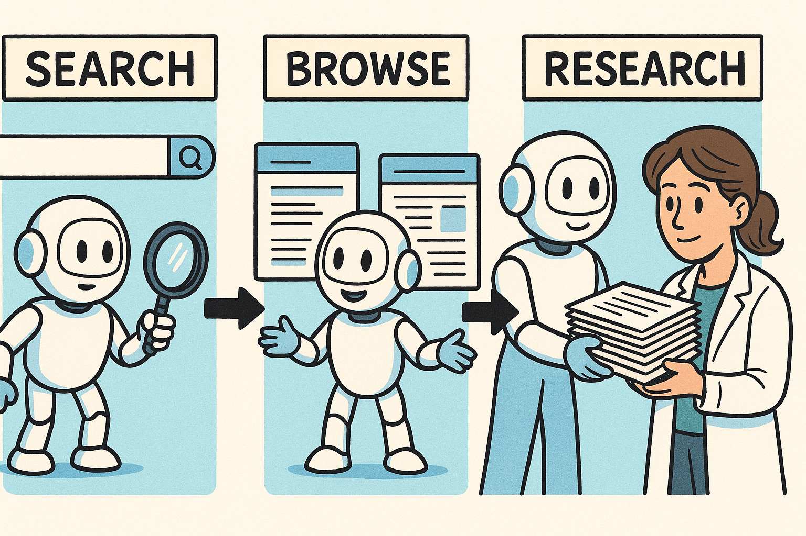

# Deep Research

This project enables automated scientific research using Large Language Models (LLMs) and search APIs. I've deliberately kept this readme simple. More discussion on this topic can be found in the linked Medium community science post.

## 🛠 Setup

### 1. Clone the repository
```bash
git clone https://github.com/jd-coderepos/deep-research.git
cd deep-research
```

### 2. Create and activate a virtual environment
```bash
# Windows
python -m venv venv
venv\Scripts\activate

# macOS/Linux
python3 -m venv venv
source venv/bin/activate
```

### 3. Install dependencies
```bash
pip install -r requirements.txt
```

### 4. Set up environment variables

Create a `.env` file in the project root with the following content:
```
OPENAI_API_KEY=your-openai-api-key
FIRECRAWL_API_KEY=your-firecrawl-api-key
```
> ⚠️ Do not commit .env to version control.

## 🚀 Run the Application

To start the research process:
```bash
python src/main.py
```

## 📁 Project Structure
```bash
deep-research/
├── src/              # Main source code
├── scripts/          # Research evaluation pipeline
├── data/             # Research data and reports
├── requirements.txt  # Python dependencies
└── README.md         # Setup instructions
```

## 📊 Research Evaluation Pipeline

After generating research reports, you can evaluate their quality using the qualitative analysis pipeline:

```bash
cd scripts
python qualitative_analysis_pipeline.py
```

The pipeline provides comprehensive quality assessment across different depth-breadth configurations, generating:
- Multi-dimensional quality metrics
- Publication-ready visualizations
- Comparative analysis reports
- Statistical evaluation of research effectiveness

For detailed documentation on the evaluation pipeline, see [`scripts/README.md`](scripts/README.md).

## 🙌 Acknowledgment

This project is a Python reimplementation of the original [deep-research](https://github.com/dzhng/deep-research) repository by [David Zhang](https://github.com/dzhng), developed in TypeScript.
Credit goes to the original author for the concept and design of the deep-research workflow.
